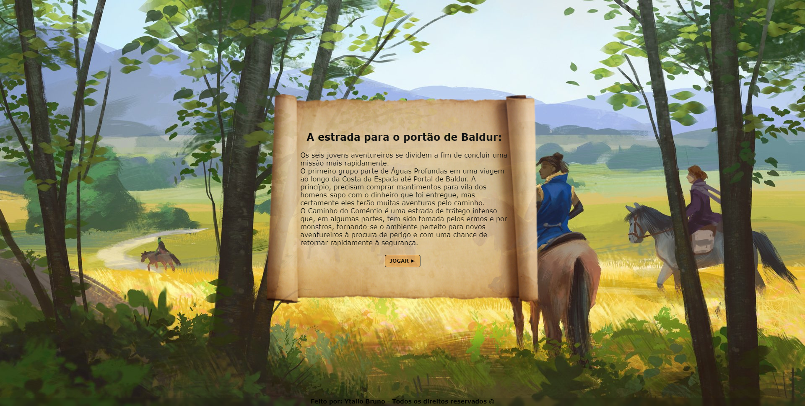

# Projeto final do Módulo 1: Jogo de escolhas 🕹️

  <a href="#sobre" align=center> Sobre </a>&nbsp;&nbsp;&nbsp;
  <a href="#andamento" align=center> Andamento </a>&nbsp;&nbsp;&nbsp;
  <a href="#linguagens" align=center> Softwares & Ferramentas utilizadas </a>&nbsp;&nbsp;&nbsp;
  <a href="#habilidades" align=center> Habilidades adquiridas </a>&nbsp;&nbsp;&nbsp;
  <a href="#autor" align=center> Autor </a> 

<h2 id="sobre">Sobre 🔎</h2>

Projeto de encerramento do módulo 1, onde o objetivo foi criar um jogo de escolhas com o propósito de praticar o que aprendemos durante as aulas ministradas pelo facilitador Artur Moreira.  
O tema escolhido pelo meu grupo foi "Caverna do Dragão", então busquei três personagens da história e implementei numa aventura one-shot (para uma sessão) de rpg. 
Para uma melhor visualização, recomendo utilizar computador ou notebook para jogar!

<h2 id="andamento">Andamento do projeto 📈</h2>

<h2 id="linguagens">Softwares & Ferramentas utilizadas nesse projeto 📚</h2>

- [x] HTML5
- [x] CSS3
- [x] JavaScript

<h2 id="habilidades">Habilidades Adquiridas 📝</h2>

- Indentação do código
- Tags semânticas (HTML)
- Seletores e Combinadores (CSS)
- Classes (CSS)
- Gradientes (CSS)
- Pseudo-classes (CSS)
- Display Flex (CSS)
- Funções (JS)
- Prompt e Alert (JS)
- If, Else (JS)
- While (JS)

  
  **Criado e desenvolvido por [Ytallo Bruno](https://www.linkedin.com/in/ytallobruno/).**
  
  
 
     
    &nbsp;&nbsp;&nbsp;&nbsp;&nbsp;
    
    &nbsp;&nbsp;&nbsp;&nbsp;&nbsp;
    
  

